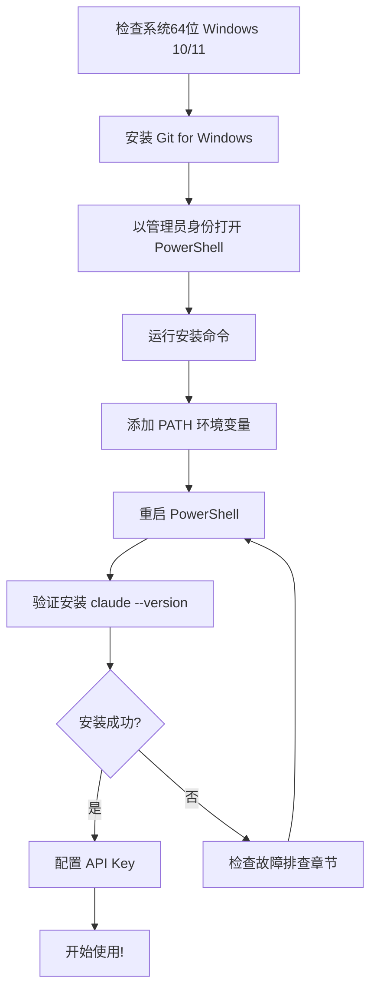

# Windows 系统安装 Claude Code 完整教程

> 适用于 Windows 10/11 (64位) 系统的 Claude Code 安装指南

## 📋 目录

- [系统要求](#系统要求)
- [完整安装步骤](#完整安装步骤)
  - [第一步：安装 Git for Windows](#第一步安装-git-for-windows必需)
  - [第二步：安装 Claude Code](#第二步安装-claude-code)
  - [第三步：配置环境变量](#第三步配置环境变量添加-path)
  - [第四步：验证安装](#第四步验证安装)
  - [第五步：配置 API Key](#第五步配置-api-key)
- [重要注意事项](#重要注意事项)
- [故障排查](#故障排查)
- [常用命令](#常用命令)

---

## 系统要求

- ✅ **操作系统**：Windows 10 或 Windows 11（**必须是 64 位**）
- ✅ **内存**：建议 4GB 以上
- ✅ **硬盘空间**：约 2-4GB
- ✅ **网络**：需要联网进行安装和使用
- ✅ **权限**：需要管理员权限

---

## 完整安装步骤

### 第一步：安装 Git for Windows（必需）

> ⚠️ **重要**：Claude Code 在 Windows 上依赖 Git Bash 运行，必须先安装 Git。

#### 1.1 下载 Git

访问 Git 官网下载页面：
```
https://git-scm.com/downloads/win
```

点击下载最新的 **64 位版本**。

#### 1.2 安装 Git

1. 双击下载的安装文件（如 `Git-2.51.2-64-bit.exe`）
2. **全程使用默认选项**，一路点击 "Next"
3. 确保在 "Adjusting your PATH environment" 步骤中选择：
   - ✅ **"Git from the command line and also from 3rd-party software"**（默认选项）
4. 点击 "Install" 开始安装
5. 完成后点击 "Finish"

#### 1.3 验证 Git 安装

1. 按 `Win + R`
2. 输入 `cmd`，按回车
3. 在命令提示符中输入：

```bash
git --version
```

✅ 如果显示类似 `git version 2.51.2.windows.1`，说明安装成功。

---

### 第二步：安装 Claude Code

#### 2.1 以管理员身份打开 PowerShell

1. 按 `Win` 键
2. 输入 `powershell`
3. **右键**点击 "Windows PowerShell"
4. 选择 **"以管理员身份运行"**

#### 2.2 运行安装命令

在 PowerShell 中复制并运行以下命令：

```powershell
irm https://claude.ai/install.ps1 | iex
```

#### 2.3 等待安装完成

安装过程会显示进度信息，完成后会显示：

```
✅ Installation complete!
Version: 2.0.34
Location: C:\Users\你的用户名\.local\bin\claude.exe
```

---

### 第三步：配置环境变量（添加 PATH）

安装完成后需要将 Claude 添加到系统 PATH，这样才能在任何地方运行 `claude` 命令。

#### 方法一：图形界面操作（推荐新手）

1. 按 `Win + R`，输入 `sysdm.cpl`，按回车
2. 点击 **"高级"** 标签
3. 点击 **"环境变量"** 按钮
4. 在 **"用户变量"** 区域（窗口上半部分），找到并双击 `Path`
5. 点击 **"新建"** 按钮
6. 输入：`C:\Users\你的用户名\.local\bin`
   - 将 `你的用户名` 替换为实际的 Windows 用户名
7. 依次点击 **"确定"** 关闭所有窗口

#### 方法二：PowerShell 命令（快速）

在 PowerShell（管理员模式）中运行：

```powershell
[Environment]::SetEnvironmentVariable("Path", $env:Path + ";C:\Users\$env:USERNAME\.local\bin", "User")
```

---

### 第四步：验证安装

#### 4.1 重启 PowerShell

⚠️ **必须关闭所有 PowerShell 窗口并重新打开**，PATH 修改才会生效。

#### 4.2 测试命令

打开新的 PowerShell 窗口，输入：

```powershell
claude --version
```

✅ 如果显示版本号（如 `2.0.34`），说明安装成功！

---

### 第五步：配置 API Key

要使用 Claude Code，需要配置 Anthropic 的访问权限。

#### 选项 A：使用 Claude Pro/Max 订阅（推荐）

如果您已订阅 Claude Pro ($20/月) 或 Max ($100/月)：

1. 在项目目录中运行：
   ```powershell
   claude
   ```
2. 按照提示完成 OAuth 登录

#### 选项 B：使用 API 付费

1. 访问 Anthropic Console：https://console.anthropic.com/
2. 登录并设置付费方式
3. 在左侧菜单找到 **"API Keys"**
4. 点击 **"Create Key"** 创建新的 API key
5. 复制生成的 API key
6. 在 PowerShell 中运行：
   ```powershell
   claude config set apiKey
   ```
7. 粘贴您的 API key 并按回车

---

## 重要注意事项

### ⚠️ 常见错误及解决方法

| 错误信息 | 原因 | 解决方法 |
|---------|------|---------|
| `'claude' 不是内部或外部命令` | PATH 未配置或 PowerShell 未重启 | 添加 PATH 后**必须关闭并重新打开** PowerShell |
| `Claude Code does not support 32-bit` | 使用了 32 位 PowerShell 或系统 | 确保系统是 64 位，使用 64 位 PowerShell |
| `requires git-bash` | Git 未安装 | 必须先安装 Git for Windows |
| `'claude-code' 不是内部或外部命令` | 命令名错误 | 正确命令是 `claude`，不是 `claude-code` |

### ✅ 关键要点

- 🔴 **命令名是 `claude`，不是 `claude-code`**
- 🔴 **必须先安装 Git，再安装 Claude Code**
- 🔴 **添加 PATH 后必须重启 PowerShell**
- 🔴 **PowerShell 必须以管理员身份运行（安装时）**
- 🔴 **系统必须是 64 位 Windows**

---

## 故障排查

### 问题 1：找不到 `git` 命令

**症状**：
```
'git' 不是内部或外部命令
```

**解决方法**：
1. 检查 Git 是否已安装
2. 重新安装 Git for Windows
3. 重启计算机后再试

---

### 问题 2：找不到 `claude` 命令

**症状**：
```
'claude' 不是内部或外部命令
```

**解决方法**：
1. 检查是否已添加到 PATH（参考第三步）
2. **关闭所有 PowerShell 窗口后重新打开**
3. 使用完整路径测试：
   ```powershell
   C:\Users\你的用户名\.local\bin\claude.exe --version
   ```

---

### 问题 3：32 位系统错误

**症状**：
```
Claude Code does not support 32-bit Windows
```

**解决方法**：
1. 检查系统是否为 64 位：
   - 按 `Win + Pause/Break`
   - 查看 "系统类型"
2. 确保使用 64 位 PowerShell：
   - 按 `Win + R`
   - 输入：`%SystemRoot%\System32\WindowsPowerShell\v1.0\powershell.exe`

---

### 问题 4：权限错误

**症状**：
```
无法加载文件，因为在此系统上禁止运行脚本
```

**解决方法**：

在 PowerShell（管理员模式）中运行：
```powershell
Set-ExecutionPolicy RemoteSigned -Scope CurrentUser
```

---

## 常用命令

安装完成后，您可以使用以下命令：

```powershell
# 查看版本
claude --version

# 查看帮助
claude --help

# 在当前目录启动 Claude Code
claude

# 指定模型启动
claude --model claude-sonnet-4-20250514

# 查看配置
claude config list

# 设置 API Key
claude config set apiKey
```

---

## 安装流程图



---

## 使用示例

### 基础使用

```powershell
# 进入您的项目目录
cd C:\Users\你的用户名\Documents\my-project

# 启动 Claude Code
claude

# Claude 会分析您的项目并等待您的指令
# 您可以用自然语言描述您想做什么
```

### 示例对话

```
> 创建一个 Python 函数来检查回文
> 为这个函数添加单元测试
> 重构代码使其更高效
> 解释这段代码的工作原理
```

---

## 总结

Windows 上安装 Claude Code 的核心步骤：

1. ✅ **先装 Git** - 这是前提条件
2. ✅ **用 PowerShell 安装** - 以管理员身份运行
3. ✅ **配置 PATH** - 让系统能找到 `claude` 命令
4. ✅ **重启终端** - 让 PATH 配置生效
5. ✅ **记住命令名是 `claude`** - 不是 `claude-code`

按照本教程，整个安装过程大约需要 **10-15 分钟**。

---

## 相关链接

- 📚 [Claude Code 官方文档](https://docs.claude.com/en/docs/claude-code)
- 🌐 [Anthropic Console](https://console.anthropic.com/)
- 💻 [Git for Windows 下载](https://git-scm.com/downloads/win)
- 📖 [Claude 官网](https://claude.ai/)

---

## 许可证

本教程基于实际安装经验编写，欢迎分享和改进。

---

## 贡献

如果您在安装过程中遇到问题或有改进建议，欢迎：
- 提交 Issue
- 提交 Pull Request
- 分享您的经验

---

**最后更新时间**：2025年11月

**作者**：Whistle

**适用版本**：Claude Code 2.0.34+

